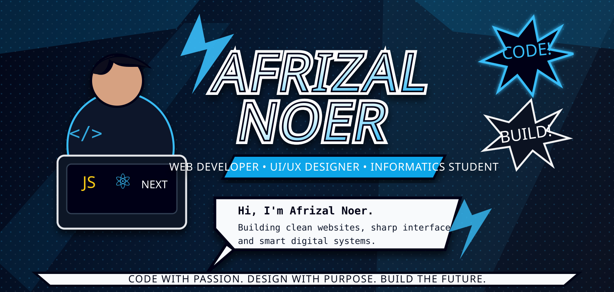

 

 

---

## 🦸‍♂️ Developer Profile

<table>
<tr>
<td width="60%">

I'm **Afrizal Noer**, an **Informatics Student** who enjoys building digital products with a strong visual identity and real functionality.

I focus on creating projects that are:

- ⚡ Clean and responsive
- 🎯 Useful and functional
- 🎨 Modern in interface design
- 🧠 Structured in code logic
- 🚀 Ready to keep improving

</td>
<td width="40%" align="center">

</td>
</tr>
</table>

---

## ⚙️ Tech Arsenal

### Frontend

### Backend & Database

### Tools

---

## 🔥 Featured Projects

<table>
<tr>
<td width="50%">

### 🌐 Personal Portfolio

Personal website to showcase profile, skills, projects, and contact information.

**Focus:** Clean UI • Responsive Layout • Personal Branding

</td>
<td width="50%">

### ☕ Coffee Shop Website

Modern website concept for a coffee shop with attractive layout and product sections.

**Focus:** Landing Page • Product Display • Business Website

</td>
</tr>

<tr>
<td width="50%">

### 🎫 Pijar Music Event

UI/UX design for a charity music event website with ticket and donation features.

**Focus:** Event Website • Ticket Flow • Donation Feature

</td>
<td width="50%">

### 🏝️ Mentawai Tourism Website

Tourism website concept for Mentawai with destination information and ticket purchase flow.

**Focus:** Travel Website • Ticketing • Nature Design

</td>
</tr>

<tr>
<td width="50%">

### 🔐 Smart Door Lock System

IoT-based smart lock project using fingerprint, solenoid lock, buzzer, LCD, and microcontroller.

**Focus:** IoT • Security System • Smart Access

</td>
<td width="50%">

### ⚙️ Web Application Projects

Various web apps using HTML, CSS, JavaScript, PHP, Laravel, React, and database systems.

**Focus:** CRUD • Dashboard • Authentication • Database

</td>
</tr>
</table>

---

## 📊 GitHub Battle Stats

  

---

## 🧠 Developer Mindset

<table>
<tr>
<td align="center" width="25%">

### ⚡ Clean Code
Readable and structured.

</td>
<td align="center" width="25%">

### 🎨 Sharp UI
Modern and responsive.

</td>
<td align="center" width="25%">

### 🛠️ Real Function
Useful, not only decoration.

</td>
<td align="center" width="25%">

### 🚀 Consistency
Learn, build, improve.

</td>
</tr>
</table>

---

  

